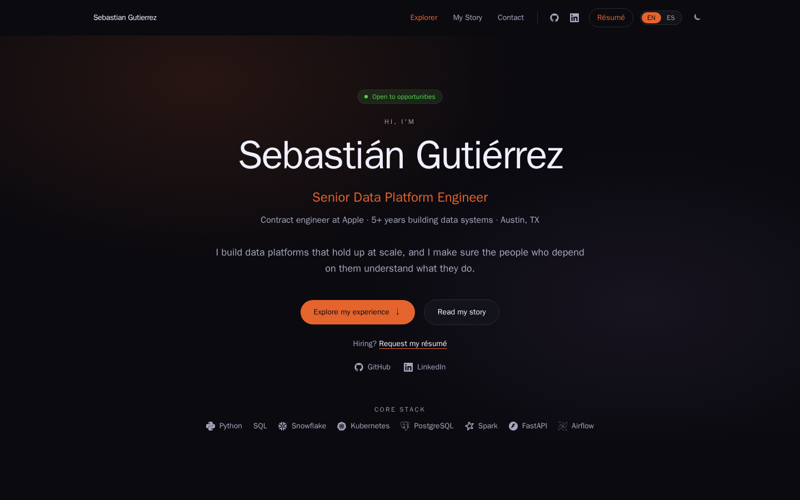
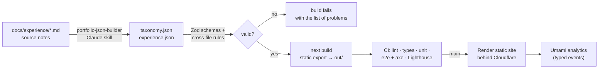

# Sebastián Gutiérrez · portfolio

[](https://github.com/CevittoG/personal-portafolio/actions/workflows/ci.yml)

**Live:** [asebagutierrezm.com](https://asebagutierrezm.com) · [Spanish](https://asebagutierrezm.com/es)

A bilingual portfolio for a data platform engineer, built the way I'd build a
small data product: content lives in versioned files with a schema, every
build validates it, and CI checks what the site promises (routes, languages,
accessibility, performance) before anything deploys.



---

## How it works



1. **Source notes to data.** Each role is documented in `docs/experience/*.md`.
   A Claude skill (`.claude/skills/portfolio-json-builder`) turns them into two
   JSON files: a controlled vocabulary of 210 tags (`taxonomy.json`) and the
   entries themselves (`experience.json`).
2. **Contracts.** `src/content/schema.ts` defines both files in Zod; the
   TypeScript types are `z.infer` of those schemas, so data, types and
   validator can't drift. `src/content/validate.ts` adds the rules a schema
   can't express: every tag resolves under the right type, ids are unique,
   `related` links resolve, and hand-maintained lists in code (search
   aliases, starter tags, career lanes) point at real tags and entries.
3. **Build.** The root layout calls `assertValidContent()`, so invalid data
   fails `next build` everywhere (locally, in CI, on Render) with a readable
   list of problems. Zod runs at build time only; the browser gets types, not
   a validator.
4. **Static site.** Next.js 16 exports every page in English at `/…` and
   Spanish at `/es/…`, each language with its own root layout so
   `<html lang>` is right in the HTML, plus per-page canonical and hreflang,
   a sitemap, JSON-LD and branded share images. Production is plain HTML on Render, behind
   Cloudflare. No server, no database.
5. **Analytics.** Umami, cloud-hosted, with a typed event map
   (`src/lib/analytics/umami.ts`) so every tracked click is checked at
   compile time.

## Quality gates

Every pull request and every push to `main` runs, in order:

| Step | What it proves |
|---|---|
| `pnpm lint`, `pnpm type-check` | Code style and types |
| `pnpm validate:data` | Content matches its schema and cross-file rules |
| `pnpm test` | Unit tests: locale paths, translator and catalogue parity, date math, overlap-merged years, sorting, related-role scoring, card tag selection, translations, search aliases and typo matching, and data integrity (including tests that break the data on purpose) |
| `pnpm build` | Static export succeeds (and re-validates content) |
| `pnpm test:e2e` | Playwright tests against the served export: every page returns 200 with the right `lang`, canonical and hreflang; zero axe color-contrast violations in dark **and** light theme; no page throws or fails hydration, with and without reduced motion |
| `pnpm lhci` | Lighthouse budget: accessibility ≥ 95, SEO ≥ 95, best practices ≥ 90 (errors); performance ≥ 90 (warning) |

The end-to-end suite has already paid for itself: its first run found tag
colors below 4.5:1 contrast and a hydration mismatch that reset the Spanish
`lang` for visitors with reduced motion enabled. Both are fixed, and the
color tokens are now computed to clear 4.6:1 on every surface they sit on.

## Architecture decisions

Short records of the choices that shape the code. Each one names what was
given up.

**1. Static export, no server.** The site is content that changes when I
edit it, so every page is prerendered and served as files (Render +
Cloudflare). *Trade-off:* no middleware, no per-request logic; anything
dynamic must happen at build time or in the browser.

**2. A small custom i18n layer instead of next-intl.** English must stay
unprefixed (`/story`) with Spanish under `/es`. next-intl does that with
middleware, which a static export can't run. `src/i18n/` is a typed
dot-path translator, a provider, and path helpers, about 200 lines. Each
language is its own root layout (`app/(en)`, `app/(es)`), so `lang` is in
the static HTML and each page ships only its own catalogue.
*Trade-off:* no ICU plurals, and switching language is a full page load
(two root layouts can't share a client-side navigation).

**3. Flat JSON with contracts, not a CMS.** Two files in git are the whole
content model: diffable, reviewable, and validated on every build.
*Trade-off:* editing needs a pull request, and the narrowing from raw JSON to
typed data is one documented cast (`src/content/data.ts`) trusted because the
build validates first.

**4. Server by default, client islands only where interactive.** Pages are
React Server Components; the filterable grid, drawer and search are the
client island. Anything computed from "today" (the career timeline's ongoing
bar) renders on the server, so static HTML and hydration can't disagree.
Reduced-motion variants switch only after mount for the same reason. The
server shapes what the island gets: entries with descriptions cut to the
drawer teaser, and a small tag index instead of the taxonomy, so neither
JSON file ships as JavaScript. *Trade-off:* data is shaped twice, once for
server pages and once for the island's props.

**5. The résumé is request-only.** There is no PDF in `public/`. The site
carries what a recruiter screen needs (role, years, stack, location, work
authorization, degree) and the résumé comes by email, tailored to the role.
*Trade-off:* one more step for a recruiter, in exchange for a conversation
and a résumé that fits the job.

**6. Accessibility is tested, not assumed.** Contrast is checked by axe in
both themes on every page, text never goes below 12px, touch targets are at
least 24px, and motion respects `prefers-reduced-motion`. *Trade-off:* the
tag palette is a little less saturated than the original design.

**7. Plain modules over single-implementation interfaces.** The first
version wrapped every data access and rule in an interface plus a class
(repositories, filter strategies, stat computers). Most had one
implementation and some had dead methods, so they became plain functions
and objects. An interface stays only where implementations actually
compose (search: an alias strategy wraps the substring one). *Trade-off:*
swapping an implementation later means editing its callers, which a
single-implementation codebase does rarely.

## Project map

```
src/
  app/            routes: (en)/… and es/…, sitemap, robots, og/[image] share images
  components/     explorer, story, contact, experience (deep dive), hero, search, tags
  content/        schema.ts (Zod), validate.ts, data.ts (typed boundary), assert-valid.ts
  data/           taxonomy.json, experience.json
  i18n/           messages (en, es), translator, provider, path helpers
  lib/            experience, search, story, related, stats, site, analytics, theme
tests/
  unit/           Vitest
  e2e/            Playwright + axe
docs/
  portfolio-website-plan.md   the plan and its status log
  experience/                  source notes per role
  deploy/security-headers.md   response headers for Render
```

## Running it

Docker is the development environment; nothing is needed on the host.

```bash
docker compose up dev                              # http://localhost:3000
docker compose run --rm dev pnpm test              # unit tests
docker compose run --rm dev pnpm validate:data     # content check only
docker compose run --rm dev pnpm build             # static export → out/
docker compose --profile preview up --build preview  # nginx on http://localhost:8080
```

End-to-end tests need a Playwright browser, which the Alpine dev image can't
run. Use the official image against a fresh build:

```bash
docker run --rm -v "$PWD":/work -v /work/node_modules -w /work mcr.microsoft.com/playwright:v1.63.0-noble \
  bash -c "corepack enable && pnpm install --frozen-lockfile && pnpm test:e2e"
```

## Further reading

- [docs/portfolio-website-plan.md](docs/portfolio-website-plan.md): the full
  plan, component specs and a dated status log of every change.
- [DESIGN.md](DESIGN.md) and [PRODUCT.md](PRODUCT.md): the visual system and
  who the site is for.
- The same story on the site itself: [How it's built](https://asebagutierrezm.com/how-its-built).
